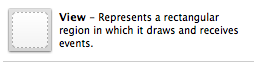
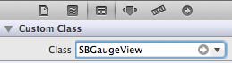
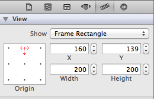
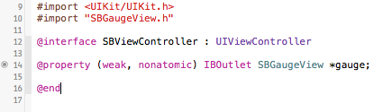
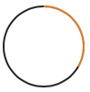

# SBGauge

SBGauge is a simple gauge view for iOS. You can easily customize color, size &amp; segments.

## Getting Started

### Installing manually

Clone this respository and add these files to your project:

```bash
SBGauge/SBGaugeView.h
SBGauge/SBGaugeView.m
SBGauge/SBGaugeContext.h
SBGauge/SBGaugeContext.m
```

Then just import SBGaugeView into your view controller:

```objective-c
#import "SBGaugeView.h"
```

## Usage

You can use `SBGauge` by instantiating it programatically or with interface builder.

### Programmatically

```objective-c
UIColor *gaugeColor = [UIColor colorWithRed:0.87 green:0.49 blue:0.16 alpha:1.0];
UIColor *trackColor = [UIColor colorWithRed:0.14 green:0.14 blue:0.14 alpha:1.0];

SBGauge *donutGauge = [[SBGaugeView alloc] initWithSegments:6
                                                     width:20.0
                                                gaugeColor:gaugeColor
                                                trackColor:trackColor];

```

### Interface Builder

*Drop a blank UIView into your window:*<br/>


*Set the view's class to SBGaugeView:*<br/>


*Set the size to a square for best results:*<br/>


*Connect the view to your view controller:*<br/>

<br/>

Once the view is hooked up, you can update the configuration with the settings you need:

```objective-c
- (void)viewDidLoad
{
  [super viewDidLoad];
  UIColor *gaugeColor = [UIColor colorWithRed:0.87 green:0.49 blue:0.16 alpha:1.0];
  UIColor *trackColor = [UIColor colorWithRed:0.14 green:0.14 blue:0.14 alpha:1.0];

  [self.gauge updateSegments:6
                       width:20.0
                  gaugeColor:gaugeColor
                  trackColor:trackColor];
}
```

## Examples

### Donut

Setting a thicker width makes a donut shape gauge:


```objective-c
- (void)viewDidLoad
{
  // Setup a donut-style gauge
  SBGauge *donutGauge = [[SBGaugeView alloc] initWithSegments:6
                                                       width:20.0
                                                  gaugeColor:gaugeColor
                                                  trackColor:trackColor];

  // Increase the gauge by 1 step
  [donutGauge stepUp];
}
```

### Pie

Making a pie is as simple as setting a width that is half the size of the containing frame.


```objective-c
- (void)viewDidLoad
{
  // Setup a pie-style gauge
  SBGauge *pieGauge = [[SBGaugeView alloc] initWithSegments:6
                                                        width:self.frame.size.width/2.0
                                                  gaugeColor:gaugeColor
                                                  trackColor:trackColor];

  // Increase the gauge by 1 step
  [pieGauge stepUp];
}
```

### Progress

Use a timer to increase steps over time:


```objective-c
- (void)viewDidLoad
{
  // Setup a progress gauge
  SBGauge *progressGauge = [[SBGaugeView alloc] initWithSegments:6
                                                        width:2.0
                                                  gaugeColor:gaugeColor
                                                  trackColor:trackColor];

  // Increase the gauge by 1 step
  [progressGauge stepUp];
}

- (IBAction)play:(id)sender {
  self.timer = [NSTimer scheduledTimerWithTimeInterval:0.2
                                           target:self
                                         selector:@selector(increaseProgressGauge)
                                         userInfo:nil
                                          repeats:YES];
}

- (void) increaseProgressGauge {
  [self.progressGauge stepUp];
  
  self.currentProgressStep += 1;
  if(self.currentProgressStep >= 6) {
    self.currentProgressStep = 0;
    [self.timer invalidate];
    self.timer = nil;
  }
}
```